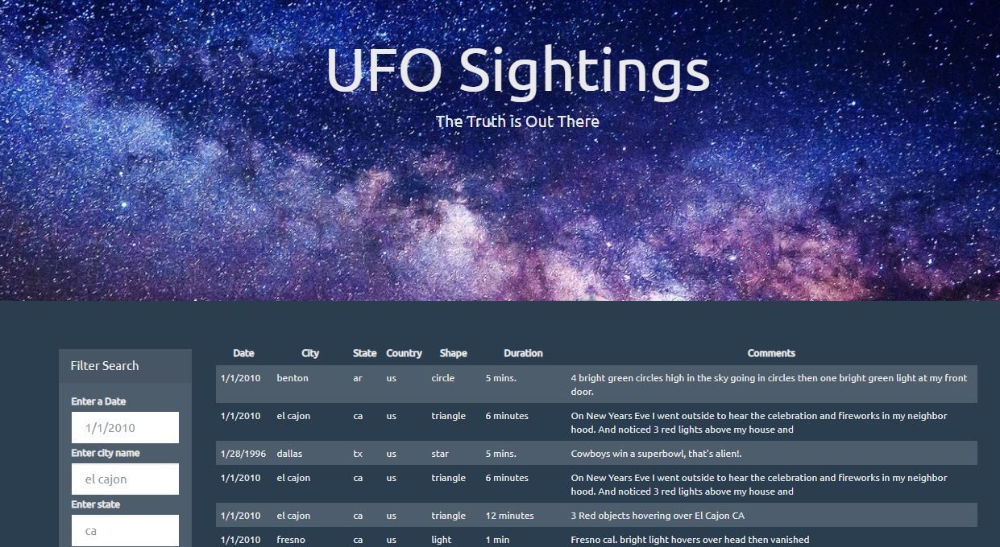

# UFO Finder
This is a JavaScript based project where I wrote a code to create a table dynamically based upon a provided dataset (data.js). 
Form on left-hand side filters data by one or multiple requirements and generates table on HTML page. 

I also used HTML, CSS and D3 to create user interface.
To view deployed version please navigate to: https://olegmrnv.github.io/UFO_finder/

